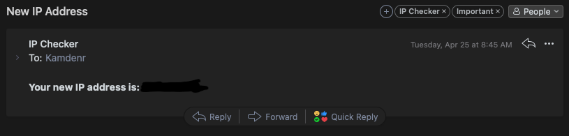

# IPChecker

IPChecker is a simple Go application that periodically checks your public IP address and can send you an email when it changes. This can be useful if you need to remotely access your home network and your ISP assigns you a dynamic IP address. Used for Dynamic Domain Name Service (DDNS) purposes.

## Prerequisites

Before running IPChecker, you need to have the following:

1. A stationary system that can run Go applications
2. Docker installed on the system

If you want to use SendGrid, you will also need the following

1. A working email account that can send and receive emails
2. A SendGrid account and API key

## Installation

1. Clone this repository to your local machine
2. Install the dependencies using the following command:

    ```bash
    go mod download
    ```

3. Set the necessary environment variables by creating a .env file at the root of the project directory. The following variables are required:

    ```bash
    CURRENT_IP #SET THIS TO 11.111.111.111
    ```

4. Build the application using the following command:

    ```bash
    make build
    make run
    ```

## Environment Variables

### Cloudflare:

| Name                   | Description                       |
|  --------              |  -------                          |
| CLOUDFLARE_ZONE_ID     | Your DNS [zone ID](https://developers.cloudflare.com/fundamentals/get-started/basic-tasks/find-account-and-zone-ids/). Can also be found by updating all env variables and running `make get-dns-id`               |
| CLOUDFLARE_DNS_ID      | The id of the DNS record          |
| CLOUDFLARE_API_KEY     | API key from Cloudflare           |
| CLOUDFLARE_EMAIL       | Email used to login to Cloudflare |
| CLOUDFLARE_DOMAIN_NAME | The domain you want updated       |

### GoDaddy:

| Name                    | Description                                                  |
|  --------               |  -------                                                     |
| GODADDY_API_KEY         | The API key from https://developer.godaddy.com/getstarted    |
| GODADDY_API_SECRET      | The API secret from https://developer.godaddy.com/getstarted |
| GODADDY_DNS_RECORD_NAME | The subdomain, can be '@' for your plain domain              |
| GODADDY_DNS_RECORD_TYPE | Record type. A, AAAA, MX, etc.                               |
| GODADDY_DOMAIN_NAME     | The domain without the subdomain                             |


### SendGrid:

| Name             | Description                         |
|  --------        |  -------                            |
| SENDER_EMAIL     | Email to send the notification from |
| RECEIVER_EMAIL   | Email to send the notification to   |
| SENDGRID_API_KEY | API key for SendGrid                |

### Misc:

| Name            | Description    |
|  --------       |  -------       |
| CURRENT_IP | Set this to be any IP value. Ex "111.111.111.111". Used as reference during the IP check to see if the IP has changed |
| DNSHOST    | Set this to `cloudflare`, `godaddy`, or `na` for your DNS |
| UPDATEDNS  | set this to `true` or `false` depending on if you want your dns to update |

## License

This project is licensed under the MIT License - see the [LICENSE](LICENSE) file for details

## Example


